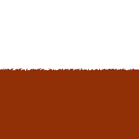
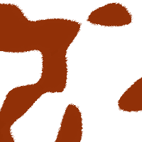

# Arbo
## What?

Arbo is real-time interactive 2D graphics engine based on SDF and ray tracing. Scene is composed from interactive reusable parts, defined as mathematical transformations over just two primitives.

Still in early experimental phase.

## Why?

This tool grew out of frustrations with current digital art techniques.

Pixel art is tedious to make at high resolution and it looks blocky at low resolution. Mixing low and high resolution assets looks horrible. It's also completely static; animation is done by switching between static images.

High resolution bitmap art is very unforgiving to artist. It's not possible to go back in history and modify single stroke while keeping the rest of work as it is. The resulting image is static and 'dumb'. Just like pixel art, high resolution art represents 2D scene that's been sampled within area of canvas. By converting shapes into image we have lost all information about shape except color at location of pixels.

Vector art is 'smarter' in sense that you can compose the scene from shapes and objects and manipulate them later. Vector art can be dynamically manipulated to create animations. The main downside is that polygons are still sampled shapes. The polygon with 100 points will look sharp and well defined only until certain zoom level. While the design starts with well-defined primitives (square, circle...), by doing few manipulations (cut, combine) those primitives are converted to dumb polygons and it's not possible to revert this operation later. In current vector art authoring tools it is also difficult to work with infinitely large shapes (ground and sky, ray of sun), smart instancing (mirrors, shadows, arrays) or recursively defined shapes (trees, fractals). Although vector art *can* be dynamic, there's little support for it in tools and in most cases it's converted and displayed as static image.

This project explores another approach inspired by signed distance fields and constructive geometry. A dynamic scene is built from small number of compose-able primitives and transformations. The benefits should include:

* fully dynamic - edit any shape at any time and see results immediately
* interactive - have scene respond to user input
* scaleable - display graphics at any zoom level without loss of detail
* reusable - build more complex scene by combining and reusing shapes
* smart - shadows, mirrors, shades and lens should reuse existing geometry
* level of detail - user should be able to make some segments as vague, painted in broad strokes, while making other segments sharp and precise

One additional goal for project is to have full content authoring platform on mobile phone with touch-based interface. It makes more sense to build a tool that can be used while away from computer.

## Current features

- very slow; unusable for fast-changing scenes
- inaccurate and non-deterministic rendering
- cumbersome to create and edit graphics
- not really interactive yet

## Concepts

A scene is hierarchical tree composed of primitives and transformations over primitives. It is expressed using nested tables in Lua syntax:

```lua
scene = {transform-name, {transform-parameters}, {sub-scene}}
```

The sub-scene follows the same nested structure, until primitives are reached. There are currently two primitives:

* **edge** (short for *lower half plane*) is primitive that is filled for y < 0 and not filled for y > 0. It represents an edge between existence and void.



  **simplex** is primitive that implements [simplex noise](https://en.m.wikipedia.org/wiki/Simplex_noise). It produces pseudo-random bloby shapes that are predictable in size and distribution, but not predictable in exact shape.



The **edge** and **simplex** represent two approaches to scene modelling. The **edge** is used when we  want to manually produce a well defined shape - a flower, sun, a building, an animal... 

The **simplex** allows us to add random patterns for vague elements that would be too hard to compose exactly - clouds, stars, animal stripes, surface irregularities, continent shapes...

Both **edge** and **simplex** produce a shape - they can be rendered on screen, or manipulated by shape transformations that also a produce shape.

Current transformations include:

* **position** is linear transform that changes shape location, rotation and scale by affecting rays's coordinate system
```
{position, {dx, dy, rot, sx, sy}, shape}
```
* **wrap** transform converts to polar coordinate system, producing oval shapes
```
{wrap, shape}
```
* **negate** creates inverse or a negative
```
{negate, shape}
```
* **join** composes a complex shape out of list of shapes
```
{join, shape1, shape2, ...}
```
* **cut** uses list of shapes to create a new shape that exists only in areas where *all* of input shapes overlap
```
{cut, shape1, shape2, ...}
```
* **tint** sets the color of drawn shape, using HSL color model
```
{tint, {hue, saturation, lightness}, shape}
```
* **memo** keeps records of already rendered shapes, for speed optimization and to enable recursive geometry
```
{memo, precision-setting, shape}
```

## Rendering

The scene is rendered similar to 3D ray-tracing technique. We start with a blank canvas that will hold the resulting image.

* a location for ray is selected from screen surface, by creating random x,y coordinate values
* the scene is traversed down-tree, with each scene element manipulating x,y coordinates or ray color
* when ray hits primitive (**edge** or **simplex**), it gets assigned alpha value and the ray returns up-tree
* ray is drawn on canvas with calculated color, alpha and stroke size

This method is done few thousand times per second. The canvas is never cleared, it's constantly overdrawn with new rays.

As scene grows in complexity, it takes more and more time to calculate value for single ray. Stroke size can be increased to get rough scene outline, and then lowered to produce finer details.

## Interactivity

This part is still not defined how it's supposed to work. Basically the scene is defined as tree structure, which is just like AST (abstract syntax tree) and lisp's S-expressions. The scene definition is both data and code. It should be possible for scene to contain instructions to modify itself.

User should specify how parts of the scene should look like in different contexts. Then depending on current context the engine could interpolate the values.

Current sample scenes execute the Lua code that's used to simulate real-time changes.

## Editor

Under construction. Current iteration can navigate the scene tree and edit numerical values on the fly. Deleting/adding elements is not supported at the moment. The sample scenes were instead constructed by writing Lua code.

## How to start up?

Grab interpreter from (LÖVE)[https://love2d.org/] and use it to execute main.lua

Development is done on Linux & Android. Currently requires touchscreen to access features.

## Showcase

Tree defined as recursive geometry - a tree is composed of a single branch and few smaller trees on top.


Sunset scene that dynamically changes location and color of shapes.


Flying above earth. Both clouds and continents are simplex noise.


Demonstration of current editor, both navigating scene tree and changing numerical values to modify colors on the fly.


