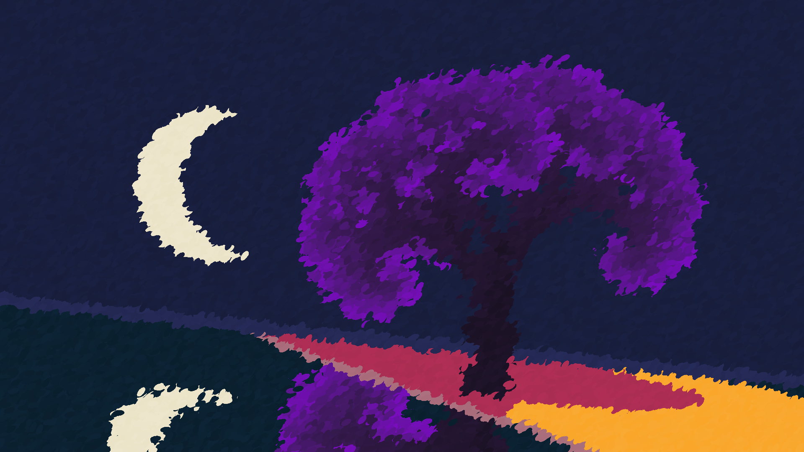
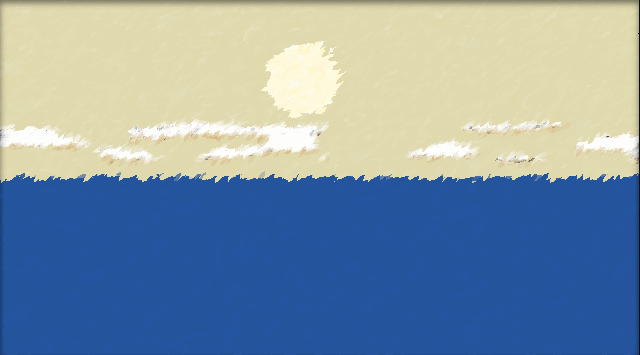

# Arbo
## What?

Arbo is real-time interactive 2D graphics engine based on SDF and ray tracing. Scene is composed from interactive reusable parts, defined as mathematical transformations over just two primitives.

Still in early experimental phase. Development is done on Linux & Android using the LÖVE framework for Lua.

## Why?

This tool grew out of frustrations with current digital art techniques.

Pixel art is tedious to make at high resolution and it looks blocky at low resolution. Mixing low and high resolution assets looks horrible. It's also completely static; animation is done by switching between static images.

High resolution bitmap art is very unforgiving to artist. It's not possible to go back in history and modify single stroke while keeping the rest of work as it is. The resulting image is static and 'dumb'. Just like pixel art, high resolution art represents 2D scene that's been sampled within area of canvas. By converting shapes into image we have lost all information about shape except color at location of pixels.

Vector art is 'smarter' in sense that you can compose the scene from shapes and objects and manipulate them later. Vector art can be dynamically manipulated to create animations. The main downside is that polygons are still sampled shapes. The polygon with 100 points will look sharp and well defined only until certain zoom level. While the design starts with well-defined primitives (square, circle...), by doing few manipulations (cut, combine) those primitives are converted to dumb polygons and it's not possible to revert this operation later. In current vector art authoring tools it is also difficult to work with infinitely large shapes (ground and sky, ray of sun), smart instancing (mirrors, shadows, arrays) or recursively defined shapes (trees, fractals). Although vector art *can* be dynamic, there's little support for it in tools and in most cases it's converted and displayed as static image.

This project explores another approach inspired by signed distance fields and constructive geometry. A dynamic scene is built from small number of compose-able primitives and transformations. The benefits should include:

* fully dynamic - edit any shape at any time and see results immediately
* interactive - have scene respond to user input
* scaleable - display graphics at any zoom level without loss of detail
* reusable - build more complex scene by combining and reusing shapes
* smart - shadows, mirrors, shades and lens should reuse existing geometry
* level of detail - user should be able to make some segments as vague, painted in broad strokes, while making other segments sharp and precise

One additional goal for project is to have full content authoring platform on mobile phone with touch-based interface. It makes more sense to build a tool that can be used while away from computer.

## Current features

- very slow; unusable for fast-changing scenes
- inaccurate and non-deterministic rendering
- cumbersome to create and edit graphics
- not really interactive yet

## Concepts

A scene is hierarchical tree composed of primitives and transformations over primitives. It is expressed using nested tables in Lua syntax:

```lua
scene = {transform-name, {transform-parameters}, {sub-scene}}
```

The sub-scene follows the same nested structure, until primitives are reached. There are currently two primitives:

* **edge** (short for *lower half plane*) is primitive that is filled for y < 0 and not filled for y > 0. It represents an edge between existence and void.


  **simplex** is primitive that implements [simplex noise](https://en.m.wikipedia.org/wiki/Simplex_noise). It produces pseudo-random bloby shapes that are predictable in size and distribution, but not predictable in exact shape.


The **edge** and **simplex** represent two approaches to scene modelling. The **edge** is used when we  want to manually produce a well defined shape - a flower, sun, a building, an animal... 

The **simplex** allows us to add random patterns for vague elements that would be too hard to compose exactly - clouds, bush, stars, animal stripes, surface irregularities...

Both **edge** and **simplex** produce a shape - they can be rendered on screen, or manipulated by shape transformations that also a produce shape.

Current transformations include:

* **position** is linear transform that changes shape location, rotation and scale by affecting rays's coordinate system
```
{position, {dx, dy, rot, sx, sy}, shape}
```
* **wrap** transform converts to polar coordinate system, producing oval shapes
```
{wrap, yexp, shape}
```
* **negate** creates inverse or a negative
```
{negate, shape}
```
* **mirror** produces another mirrored shape respective to y-axis
```
{mirror, shape}
```
* **combine** composes a complex shape out of list of shapes
```
{combine, shape1, shape2, ...}
```
* **cut** uses list of shapes to create a new shape that exists only in areas where *all* of input shapes overlap
```
{cut, shape1, shape2, ...}
```
* **smooth** softly melds one shape into another, or substracts them if softness is negative
{smooth, softness, shape1, shape2}

* **tint** sets the color of drawn shape, using HSL color model
```
{tint, {hue, saturation, lightness}, shape}
```
* **memo** keeps records of already rendered shapes, for speed optimization and to enable recursive geometry
```
{memo, precision-setting, shape}
```

## Rendering

The scene is rendered similar to 3D ray-tracing technique. We start with a blank canvas that will hold the resulting image.

* a location for ray is selected from screen surface, by creating random x,y coordinate values
* the scene is traversed down-tree, with each scene element manipulating x,y coordinates or ray color
* when ray hits primitive (**edge** or **simplex**), it gets assigned alpha value and the ray returns up-tree
* ray is drawn on canvas with calculated color, alpha and stroke size

This method is done few thousand times per second. The canvas is never cleared, it's constantly overdrawn with new rays.

As scene grows in complexity, it takes more and more time to calculate value for single ray. Stroke size can be increased to get rough scene outline, and then lowered to produce finer details.

## Interactivity

This part is still under construction.

The scene is defined as tree structure, which is just like AST (abstract syntax tree) and lisp's S-expressions. The scene definition is both data and code. It should be possible for scene to contain instructions to modify itself.

User should specify how parts of the scene should look like in different contexts. Then depending on current context the engine could interpolate the values.

Current sample scenes execute the Lua code that's used to simulate real-time changes. There's also basic support for passing environment table down the tree, that can be referenced in geometry instead of using constants.

## Editor

Under construction, to be completely re-imagined. Current iteration already has many features to navigate the scene tree and edit numerical values on the fly. 

Missing features are changing between scenes, reusing same node in different parts of trees (and navigating between contexts of reused nodes), constructing reflective geometry and editing interactive nodes.

Use one finger dragging to navigate through tree. 

When on `tint` node use two-finger swiping to modify color:

* swipe left/right to change hue

* swipe up-left/down-right to change saturation

* swipe up-right/down-left to change lightness

When on `position` node, use two finger pinch gesture to move/rotate/scale content.

When constant number is selected, use rotating gesture with two fingers to increase/decrease the value.

While navigating the scene tree, icons will show up if they are relevant in current context. Icons don't have any tooltips and not all are intuitive. Work in progress...


## How to start?

Grab interpreter from [LÖVE website](https://love2d.org/) and use it to execute `main.lua`. Currently requires screen with multi-touch to access most features (doesn't work with mouse).

As for Android, it's still too early to start packaging & distributing the APK. To run it on phone/tablet follow these instructions:

* grab v0.11 of interpreter for Android from [here](https://bitbucket.org/MartinFelis/love-android-sdl2/downloads/)

* place content of this repository into `/sdcard/lovegame` so that `main.lua` ends up on `/sdcard/lovegame/main.lua` path
* run "LÖVE for Android" interpreter

For development, the deploying can be automated with `adb push` and executing can be done using command:

`adb shell am start -S -n "org.love2d.android/.GameActivity" -d "file:///sdcard/lovegame/main.lua"`

## Showcase

Tree defined as recursive geometry - a tree is composed of a single branch and few smaller trees on top.


Same tree in more complex night scene with reflected geometry and clipping.



Sunset scene that dynamically changes location and color of shapes.



Flying above earth. Both clouds and continents are simplex noise.


Demonstration of current editor, both navigating scene tree and changing numerical values to modify colors on the fly.


